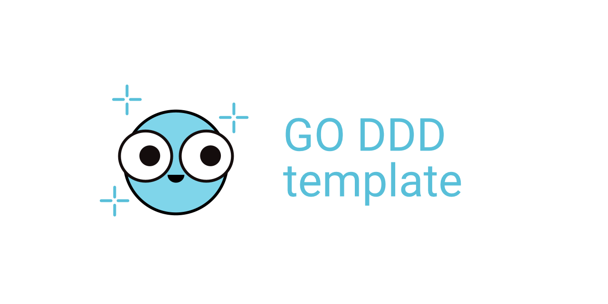

<!--markdownlint-disable MD041-->

Шаблон для создание Go сервисов с использованием архитектуры `Domain-Driven Design`.

## Обзор

## Содержание

## Быстрый старт

## Настройка Dev окружения

### Go

### Линтеры и кодогенерация

### Pre-commit hooks

### Golang-migrate
